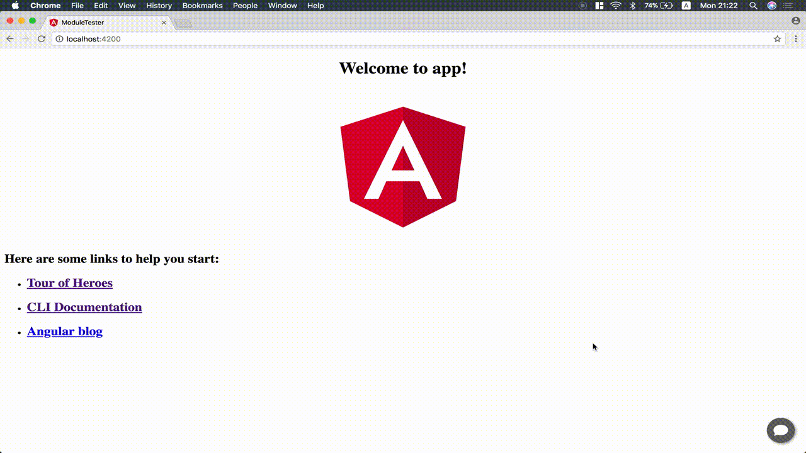

# ngx-addchat
Adding instance message shortcut to your website.
Now supported platform:
1. Whatsapp
2. Facebook Messenger


## Getting Started

### Installation
1. Install using npm:
	```bash
	npm install ngx-addchat --save
	```

2. Import `NgxAddchatModule` to your `app.module.ts`.
	```typescript
	import { NgxAddchatModule } from  'ngx-addchat'; // <-- Add this
	...

	@NgModule({
	imports: [
		NgxAddchatModule // <-- And this
	],
	...
	})
	```

3. Add element to the end of HTML (e.g. `app.component.html`)
	```html
	...
	<!-- at the end of the component -->
	<ngx-addchat></ngx-addchat>
	```

## Configuration

### Whatsapp
```
whatsapp="<country code><phone number>"
```
Insert `whatsapp` into  `<ngx-addchat>`.

**_Example_**
```html
<ngx-addchat whatsapp="85255737471"></ngx-addchat>
```
`852` is the country code of Hong Kong, and `5573 7471` is the phone number we want.

### Facebook
```
fbPageName="<the name of facebook page>"
```
Insert `fbPageName` into the `<ngx-addchat>`

**_Example_**
```html
<ngx-addchat fbPageName="appquick.co"></ngx-addchat>
```

## License

This project is licensed under the MIT License - see the [LICENSE](LICENSE) file for details

  

## Credit
**Inspired by [whatshelp]**

The original idea is from [whatshelp], which is providing a snippet which is including cross-site scripting (XSS). It may encounter some potential security issues. For more information, please check in [Angular.io/security](https://angular.io/guide/security#xss).

**Tools using in this project**
- [ionicons v2.0.1](http://ionicons.com/)
- [Facebook plugin](https://developers.facebook.com/docs/plugins/page-plugin)

## Roadmap
- Improve [Facebook Messenger plugin](https://developers.facebook.com/docs/messenger-platform/discovery/customer-chat-plugin)

- Adding more popular IM platforms

- Adding and customising the pop-out animations

- Customising the color of bubbles

## Limitation
This library is only tested on [Angular.io v5.0.0](https://angular.io).


[whatshelp]: https://whatshelp.io/widget
